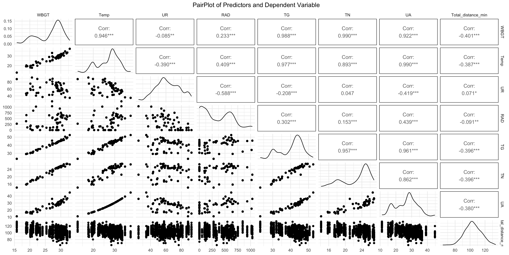

# Análise de Modelos Lineares Mistos em Python

Este repositório contém a análise estatística do arquivo `(Jul_25) Dados demandas físicas FCWC 2025.xlsx`, utilizada para investigar fatores preditores das demandas físicas de jogadores na Copa do Mundo de Clubes (FCWC).

## Objetivo

- Analisar, por meio de modelos lineares mistos, o efeito de variáveis ambientais, demográficas e de jogo sobre a demanda física dos jogadores.
- Todas as etapas do script original foram escritas em R, incluindo tratamento de dados, análise descritiva, modelagem, diagnóstico e visualização.

## Estrutura do repositório

```
.
├── data/                # Dados brutos 
├── model/               # Notebooks e scripts de análise
    └── Modelo Linear Misto.Rmd
│   └── modelo-linear-misto-python.ipynb
├── .gitignore
├── README.md
└── requirements.txt     # Dependências do projeto
```

## Como rodar o projeto

1. **Clone o repositório:**
   ```bash
   git clone https://github.com/SEU_USUARIO/linear-mixed-effects-model-fcwf-2025.git
   cd linear-mixed-effects-model-fcwf-2025
   ```

2. **Crie um ambiente virtual (recomendado):**
   ```bash
   python3 -m venv .venv
   source .venv/bin/activate
   ```

3. **Instale as dependências:**
   ```bash
   pip install -r requirements.txt
   ```

4. **Abra o notebook:**
   ```bash
   code .
   # ou
   jupyter notebook model/modelo-linear-misto-python.ipynb
   ```

6. **Execute as células do notebook na ordem.**

## Observações importantes

- O notebook está comentado para facilitar o entendimento e adaptação.
- Caso utilize outro arquivo de dados, ajuste o caminho na célula de carregamento.

## Principais bibliotecas utilizadas

- pandas, numpy, matplotlib, seaborn
- statsmodels (modelos lineares mistos)
- pingouin (estatísticas descritivas)
- tabulate (tabelas)
- openpyxl (leitura de Excel)
- scikit-learn (centralização)
- scipy (testes estatísticos)

7. **Suplementary material**

## Linearity check
Fig S1. PairPlot between continuous predictors and high intensity distance covered per minute (Zones 4 and 5).

Fig S2. PairPlot between continuous predictors and moderate intensity distance covered per minute (Zone 3).

Fig S3. PairPlot between continuous predictors and low intensity distance covered per minute (Zones 1 and 2).

Fig S4. PairPlot between continuous predictors and total distance covered per minute.


## MODEL 1 - Assumption checks
VD ~ Stage + Time_of_day + Ranking_difference + Player_position + Player_age_c + Origin_climate + WBGT_c + (1 | Player_id) + Time_of_day * WBGT_c

Table S1. Multicolinearity diagnosis

### High intensity distance covered per minute (Zones 4 and 5)
Fig S5. Mixed model 1: Histogram and Q-Q Plot of residuals; scatterplot residuals x fitted. Graphical analysis of normality and homoscedasticity of residuals
Table S2. Mixed model 1: Kolgomorov-smirnov test for residuals normality
Fig S6. Mixed model 1: Histogram and Q-Q Plot of random effects 
Table S3. Mixed model 1: Kolgomorov-smirnov test for random effects normality

### Moderate intensity distance covered per minute (Zone 3)
Fig S7. Mixed model 1: Histogram and Q-Q Plot of residuals; scatterplot residuals x fitted. Graphical analysis of normality and homoscedasticity of residuals
Table S4. Mixed model 1: Kolgomorov-smirnov test for residuals normality
Fig S8. Mixed model 1: Histogram and Q-Q Plot of random effects 
Table S5. Mixed model 1: Kolgomorov-smirnov test for random effects normality

### Low intensity distance covered per minute (Zones 1 and 2)
Fig S9. Mixed model 1: Histogram and Q-Q Plot of residuals; scatterplot residuals x fitted. Graphical analysis of normality and homoscedasticity of residuals
Table S6. Mixed model 1: Kolgomorov-smirnov test for residuals normality
Fig S10. Mixed model 1: Histogram and Q-Q Plot of random effects 
Table S7. Mixed model 1: Kolgomorov-smirnov test for random effects normality

### Total distance covered per minute
Fig S11. Mixed model 1: Histogram and Q-Q Plot of residuals; scatterplot residuals x fitted. Graphical analysis of normality and homoscedasticity of residuals


Table S8. Mixed model 1: Kolgomorov-smirnov test for residuals normality
Fig S12. Mixed model 1: Histogram and Q-Q Plot of random effects

Table S9. Mixed model 1: Kolgomorov-smirnov test for random effects normality


## MODEL 2 - Assumption checks
VD ~ Stage + Time_of_day + Ranking_difference + Player_position + Player_age_c + Origin_climate + Temp_c + UR_c + RAD_c + (1 | Player_id) + Time_of_day * Temp_c + Time_of_day * UR_c

Table S10. Multicolinearity diagnosis

### High intensity distance covered per minute (Zones 4 and 5)
Fig S13. Mixed model 2: Histogram and Q-Q Plot of residuals; scatterplot residuals x fitted. Graphical analysis of normality and homoscedasticity of residuals
Table S11. Mixed model 2: Kolgomorov-smirnov test for residuals normality
Fig S14. Mixed model 2: Histogram and Q-Q Plot of random effects 
Table S12. Mixed model 2: Kolgomorov-smirnov test for random effects normality

### Moderate intensity distance covered per minute (Zone 3)
Fig S15. Mixed model 2: Histogram and Q-Q Plot of residuals; scatterplot residuals x fitted. Graphical analysis of normality and homoscedasticity of residuals
Table S13. Mixed model 2: Kolgomorov-smirnov test for residuals normality
Fig S16. Mixed model 2: Histogram and Q-Q Plot of random effects 
Table S14. Mixed model 2: Kolgomorov-smirnov test for random effects normality

### Low intensity distance covered per minute (Zones 1 and 2)
Fig S17. Mixed model 2: Histogram and Q-Q Plot of residuals; scatterplot residuals x fitted. Graphical analysis of normality and homoscedasticity of residuals
Table S15. Mixed model 2: Kolgomorov-smirnov test for residuals normality
Fig S18. Mixed model 2: Histogram and Q-Q Plot of random effects 
Table S16. Mixed model 2: Kolgomorov-smirnov test for random effects normality

### Total distance covered per minute
Fig S19. Mixed model 2: Histogram and Q-Q Plot of residuals; scatterplot residuals x fitted. Graphical analysis of normality and homoscedasticity of residuals


Table S17. Mixed model 2: Kolgomorov-smirnov test for residuals normality
Fig S20. Mixed model 2: Histogram and Q-Q Plot of random effects


Table S18. Mixed model 2: Kolgomorov-smirnov test for random effects normality


## MODEL 5 - Assumption checks
VD ~ Stage + Time_of_day + Ranking_difference + Player_position + Player_age_c + Origin_climate + WBGT_c + UR_c + (1 | Player_id) + Time_of_day * UR_c + Time_of_day * WBGT_c

### High intensity distance covered per minute (Zones 4 and 5)
Fig S21. Mixed model 5: Histogram and Q-Q Plot of residuals; scatterplot residuals x fitted. Graphical analysis of normality and homoscedasticity of residuals
Table S19. Mixed model 5: Kolgomorov-smirnov test for residuals normality
Fig S22. Mixed model 5: Histogram and Q-Q Plot of random effects 
Table S20. Mixed model 5: Kolgomorov-smirnov test for random effects normality

### Moderate intensity distance covered per minute (Zone 3)
Fig S23. Mixed model 5: Histogram and Q-Q Plot of residuals; scatterplot residuals x fitted. Graphical analysis of normality and homoscedasticity of residuals
Table S21. Mixed model 5: Kolgomorov-smirnov test for residuals normality
Fig S24. Mixed model 5: Histogram and Q-Q Plot of random effects 
Table S22. Mixed model 5: Kolgomorov-smirnov test for random effects normality

### Low intensity distance covered per minute (Zones 1 and 2)
Fig S25. Mixed model 5: Histogram and Q-Q Plot of residuals; scatterplot residuals x fitted. Graphical analysis of normality and homoscedasticity of residuals
Table S23. Mixed model 5: Kolgomorov-smirnov test for residuals normality
Fig S26. Mixed model 5: Histogram and Q-Q Plot of random effects 
Table S24. Mixed model 5: Kolgomorov-smirnov test for random effects normality

### Total distance covered per minute
Fig S27. Mixed model 5: Histogram and Q-Q Plot of residuals; scatterplot residuals x fitted. Graphical analysis of normality and homoscedasticity of residuals


Table S25. Mixed model 5: Kolgomorov-smirnov test for residuals normality
Fig S28. Mixed model 5: Histogram and Q-Q Plot of random effects


Table S26. Mixed model 5: Kolgomorov-smirnov test for random effects normality


## Licença

Este projeto está sob a licença MIT. Veja o arquivo LICENSE para mais detalhes.

---

Dúvidas ou sugestões? Abra uma issue ou envie um pull request!

LAFISE - Laboratório de Fisiologia do exercício - UFMG
