# Análise de Modelos Lineares Mistos em Python

Este repositório contém a análise estatística do arquivo `(Jul_25) Dados demandas físicas FCWC 2025.xlsx`, utilizada para investigar fatores preditores das demandas físicas de jogadores na Copa do Mundo de Clubes (FCWC).

## Objetivo

- Analisar, por meio de modelos lineares mistos, o efeito de variáveis ambientais, demográficas e de jogo sobre a demanda física dos jogadores.
- Todas as etapas do script original foram escritas em R, incluindo tratamento de dados, análise descritiva, modelagem, diagnóstico e visualização.

## Estrutura do repositório

```
.
├── data/                # Dados brutos 
├── model/               # Notebooks e scripts de análise
    └── Modelo Linear Misto.Rmd
│   └── modelo-linear-misto-python.ipynb
├── .gitignore
├── README.md
└── requirements.txt     # Dependências do projeto
```

## Como rodar o projeto

1. **Clone o repositório:**
   ```bash
   git clone https://github.com/SEU_USUARIO/linear-mixed-effects-model-fcwf-2025.git
   cd linear-mixed-effects-model-fcwf-2025
   ```

2. **Crie um ambiente virtual (recomendado):**
   ```bash
   python3 -m venv .venv
   source .venv/bin/activate
   ```

3. **Instale as dependências:**
   ```bash
   pip install -r requirements.txt
   ```

4. **Abra o notebook:**
   ```bash
   code .
   # ou
   jupyter notebook model/modelo-linear-misto-python.ipynb
   ```

6. **Execute as células do notebook na ordem.**

## Observações importantes

- O notebook está comentado para facilitar o entendimento e adaptação.
- Caso utilize outro arquivo de dados, ajuste o caminho na célula de carregamento.

## Principais bibliotecas utilizadas

- pandas, numpy, matplotlib, seaborn
- statsmodels (modelos lineares mistos)
- pingouin (estatísticas descritivas)
- tabulate (tabelas)
- openpyxl (leitura de Excel)
- scikit-learn (centralização)
- scipy (testes estatísticos)

7. **Suplementary material**

## Linearity check
**Fig S1. PairPlot between continuous predictors and high intensity distance covered per minute (Zones 4 and 5).**
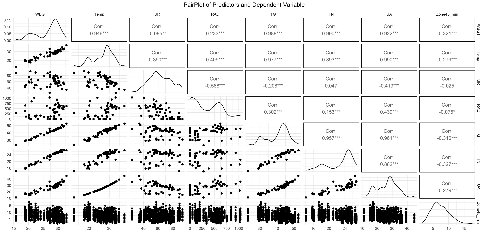

**Fig S2. PairPlot between continuous predictors and moderate intensity distance covered per minute (Zone 3).**
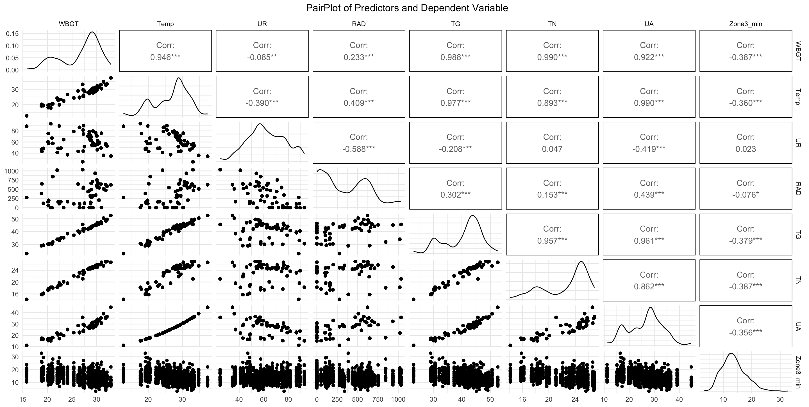

**Fig S3. PairPlot between continuous predictors and low intensity distance covered per minute (Zones 1 and 2).**
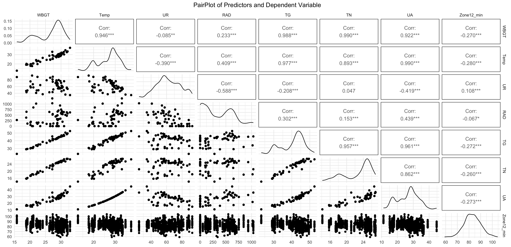

**Fig S4. PairPlot between continuous predictors and total distance covered per minute.**


## MODEL 1 - Assumption checks
VD ~ Stage + Time_of_day + Ranking_difference + Player_position + Player_age_c + Origin_climate + WBGT_c + (1 | Player_id) + Time_of_day * WBGT_c

### High intensity distance covered per minute (Zones 4 and 5)
**Table S1. Multicollinearity diagnosis**
|Predictor | VIF | VIF 95% CI | Increased SE | Tolerance | Tolerance 95% CI|
|:-----:|:-----:|:-------:|:--------------:|:-----------:|:-----------------:|
| Stage | 1.23 | [1.16, 1.34] | 1.11 | 0.81 | [0.75, 0.86] |
| Time_of_day | 1.22 | [1.15, 1.32] | 1.10 | 0.82 | [0.76, 0.87] |
| Ranking_difference | 1.15 | [1.09, 1.25] | 1.07 | 0.87 | [0.80, 0.92] |
| Player_position | 1.02 | [1.00, 1.42] | 1.01 | 0.98 | [0.71, 1.00] |
| Player_age_c | 1.04 | [1.01, 1.19] | 1.02 | 0.96 | [0.84, 0.99] |
| Origin_climate | 1.05 | [1.01, 1.18] | 1.02 | 0.95 | [0.84, 0.99] |
| WBGT_c | 1.69 | [1.56, 1.85] | 1.30 | 0.59 | [0.54, 0.64] |
| Time_of_day:WBGT_c | 1.59 | [1.47, 1.73] | 1.26 | 0.63 | [0.58, 0.68] |

**Fig S5. Mixed model 1: Histogram and Q-Q Plot of residuals; scatterplot residuals x fitted. Graphical analysis of normality and homoscedasticity of residuals**
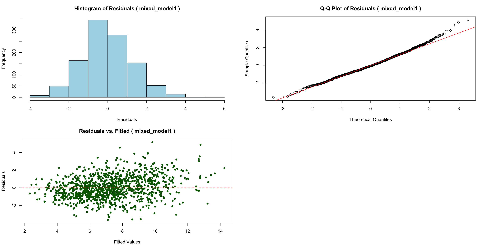

**Table S2. Mixed model 1: Kolmogorov-Smirnov test for residuals and random effects normality check**
|Data| D | p-value|
|:--:|:--:|:-----:|
|Residuals|0.04|0.003*|
|Random effects|0.05|0.01*|


**Fig S6. Mixed model 1: Histogram and Q-Q Plot of random effects**
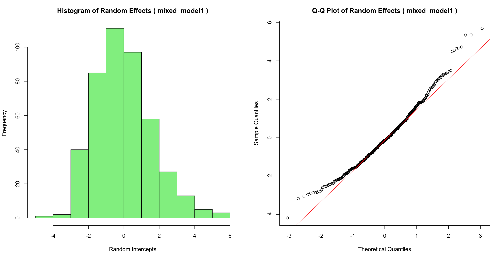

**Table S3. Mixed model 1: Kolmogorov-Smirnov test for random effects normality**

### Moderate intensity distance covered per minute (Zone 3)
**Table S4. Multicollinearity diagnosis**
|Predictor | VIF | VIF 95% CI | Increased SE | Tolerance | Tolerance 95% CI|
|:-----:|:-----:|:-------:|:--------------:|:-----------:|:-----------------:|
| Stage | 1.26 | [1.18, 1.36] | 1.12 | 0.80 | [0.73, 0.85] |
| Time_of_day | 1.22 | [1.15, 1.33] | 1.11 | 0.82 | [0.75, 0.87] |
| Ranking_difference | 1.18 | [1.11, 1.28] | 1.08 | 0.85 | [0.78, 0.90] |
| Player_position | 1.02 | [1.00, 1.47] | 1.01 | 0.98 | [0.68, 1.00] |
| Player_age_c | 1.04 | [1.01, 1.20] | 1.02 | 0.96 | [0.83, 0.99] |
| Origin_climate | 1.04 | [1.01, 1.19] | 1.02 | 0.96 | [0.84, 0.99] |
| WBGT_c | 1.68 | [1.56, 1.84] | 1.30 | 0.59 | [0.54, 0.64] |
| Time_of_day:WBGT_c | 1.57 | [1.46, 1.71] | 1.25 | 0.64 | [0.58, 0.69] |

**Fig S7. Mixed model 1: Histogram and Q-Q Plot of residuals; scatterplot residuals x fitted. Graphical analysis of normality and homoscedasticity of residuals**


**Table S5. Mixed model 1: Kolmogorov-Smirnov test for residuals normality**

**Fig S8. Mixed model 1: Histogram and Q-Q Plot of random effects**


**Table S6. Mixed model 1: Kolmogorov-Smirnov test for random effects normality**

### Low intensity distance covered per minute (Zones 1 and 2)
**Table S7. Multicollinearity diagnosis**
|Predictor | VIF | VIF 95% CI | Increased SE | Tolerance | Tolerance 95% CI|
|:-----:|:-----:|:-------:|:--------------:|:-----------:|:-----------------:|
| Stage | 1.24 | [1.17, 1.34] | 1.11 | 0.81 | [0.74, 0.86] |
| Time_of_day | 1.22 | [1.15, 1.32] | 1.10 | 0.82 | [0.76, 0.87] |
| Ranking_difference | 1.16 | [1.10, 1.26] | 1.08 | 0.86 | [0.80, 0.91] |
| Player_position | 1.02 | [1.00, 1.43] | 1.01 | 0.98 | [0.70, 1.00] |
| Player_age_c | 1.04 | [1.01, 1.19] | 1.02 | 0.96 | [0.84, 0.99] |
| Origin_climate | 1.05 | [1.01, 1.19] | 1.02 | 0.95 | [0.84, 0.99] |
| WBGT_c | 1.69 | [1.56, 1.85] | 1.30 | 0.59 | [0.54, 0.64] |
| Time_of_day:WBGT_c | 1.58 | [1.47, 1.73] | 1.26 | 0.63 | [0.58, 0.68] |

**Fig S9. Mixed model 1: Histogram and Q-Q Plot of residuals; scatterplot residuals x fitted. Graphical analysis of normality and homoscedasticity of residuals**


**Table S8. Mixed model 1: Kolmogorov-Smirnov test for residuals normality**

**Fig S10. Mixed model 1: Histogram and Q-Q Plot of random effects**
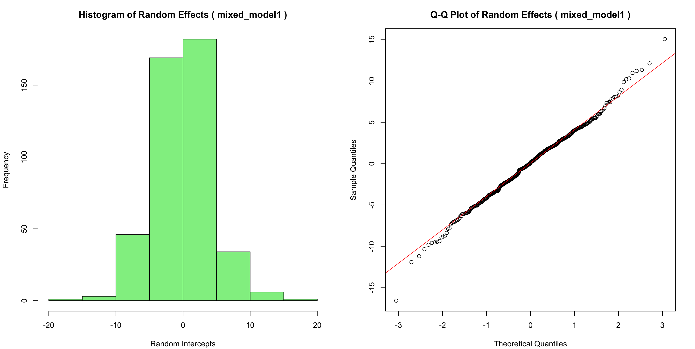

**Table S9. Mixed model 1: Kolmogorov-Smirnov test for random effects normality**

### Total distance covered per minute
**Table S10. Multicollinearity diagnosis**
|Predictor | VIF | VIF 95% CI | Increased SE | Tolerance | Tolerance 95% CI|
|:-----:|:-----:|:-------:|:--------------:|:-----------:|:-----------------:|
|Stage|1.26 |[1.18, 1.37]|    1.12      |    0.79   |  [0.73, 0.85]   |
|Time_of_day| 1.22 |[1.15, 1.33]  |       1.11  |    0.82   |  [0.75, 0.87]|
|Ranking_difference| 1.18| [1.12, 1.28]|         1.09|      0.85|     [0.78, 0.90]|
|Player_position |1.02| [1.00, 1.47]|         1.01|      0.98|     [0.68, 1.00]|
|Player_age_c | 1.04 | [1.01, 1.20] |        1.02|      0.96 |    [0.83, 0.99]|
|Origin_climate |1.04| [1.01, 1.19] |        1.02|      0.96 |     [0.84, 0.99]|
|WBGT_c |1.68 | [1.55, 1.84]|         1.30 |     0.59 |    [0.54, 0.64]|
|Time_of_day:WBGT_c | 1.57 | [1.46, 1.71] |        1.25|      0.64|     [0.58, 0.69]|

**Fig S11. Mixed model 1: Histogram and Q-Q Plot of residuals; scatterplot residuals x fitted. Graphical analysis of normality and homoscedasticity of residuals**
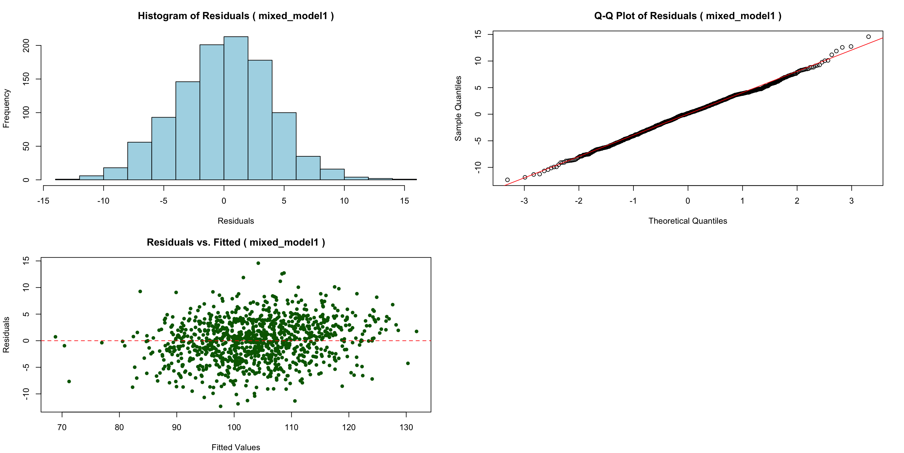

**Table S11. Mixed model 1: Kolmogorov-Smirnov test for residuals normality**

**Fig S12. Mixed model 1: Histogram and Q-Q Plot of random effects**
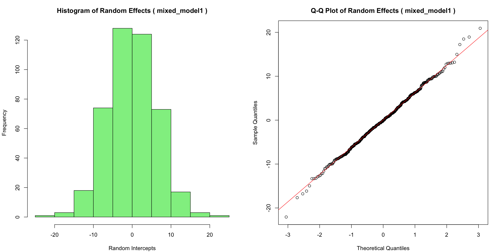

**Table S12. Mixed model 1: Kolmogorov-Smirnov test for random effects normality**

## MODEL 2 - Assumption checks
VD ~ Stage + Time_of_day + Ranking_difference + Player_position + Player_age_c + Origin_climate + Temp_c + UR_c + RAD_c + (1 | Player_id) + Time_of_day * Temp_c + Time_of_day * UR_c

### High intensity distance covered per minute (Zones 4 and 5)
**Table S13. Multicollinearity diagnosis**
|Predictor | VIF | VIF 95% CI | Increased SE | Tolerance | Tolerance 95% CI|
|:-----:|:-----:|:-------:|:--------------:|:-----------:|:-----------------:|
| Stage | 1.51 | [1.40, 1.65] | 1.23 | 0.66 | [0.61, 0.71] |
| Time_of_day | 4.51 | [4.06, 5.01] | 2.12 | 0.22 | [0.20, 0.25] |
| Ranking_difference | 1.16 | [1.10, 1.26] | 1.08 | 0.86 | [0.80, 0.91] |
| Player_position | 1.02 | [1.00, 1.39] | 1.01 | 0.98 | [0.72, 1.00] |
| Player_age_c | 1.04 | [1.01, 1.19] | 1.02 | 0.96 | [0.84, 0.99] |
| Origin_climate | 1.05 | [1.02, 1.18] | 1.03 | 0.95 | [0.85, 0.98] |
| Temp_c | 3.04 | [2.76, 3.36] | 1.74 | 0.33 | [0.30, 0.36] |
| UR_c | 4.13 | [3.73, 4.59] | 2.03 | 0.24 | [0.22, 0.27] |
| Time_of_day:Temp_c | 1.92 | [1.76, 2.10] | 1.38 | 0.52 | [0.48, 0.57] |
| Time_of_day:UR_c | 2.15 | [1.97, 2.37] | 1.47 | 0.46 | [0.42, 0.51] |
| RAD_c | 5.44 | [4.89, 6.06] | 2.33 | 0.18 | [0.16, 0.20] |

**Fig S13. Mixed model 2: Histogram and Q-Q Plot of residuals; scatterplot residuals x fitted. Graphical analysis of normality and homoscedasticity of residuals**
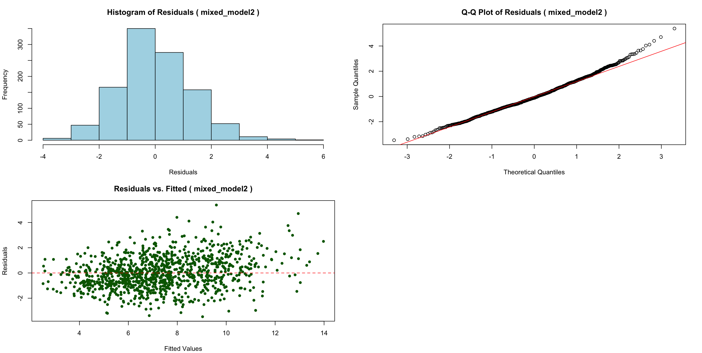

**Table S14. Mixed model 2: Kolmogorov-Smirnov test for residuals normality**

**Fig S14. Mixed model 2: Histogram and Q-Q Plot of random effects**


**Table S15. Mixed model 2: Kolmogorov-Smirnov test for random effects normality**

### Moderate intensity distance covered per minute (Zone 3)
**Table S16. Multicollinearity diagnosis**
|Predictor | VIF | VIF 95% CI | Increased SE | Tolerance | Tolerance 95% CI|
|:-----:|:-----:|:-------:|:--------------:|:-----------:|:-----------------:|
| Stage | 1.55 | [1.44, 1.69] | 1.25 | 0.64 | [0.59, 0.69] |
| Time_of_day | 4.50 | [4.05, 5.00] | 2.12 | 0.22 | [0.20, 0.25] |
| Ranking_difference | 1.19 | [1.12, 1.29] | 1.09 | 0.84 | [0.78, 0.89] |
| Player_position | 1.02 | [1.00, 1.44] | 1.01 | 0.98 | [0.70, 1.00] |
| Player_age_c | 1.04 | [1.01, 1.20] | 1.02 | 0.96 | [0.84, 0.99] |
| Origin_climate | 1.05 | [1.01, 1.18] | 1.02 | 0.95 | [0.84, 0.99] |
| Temp_c | 3.16 | [2.87, 3.50] | 1.78 | 0.32 | [0.29, 0.35] |
| UR_c | 4.19 | [3.78, 4.65] | 2.05 | 0.24 | [0.21, 0.26] |
| Time_of_day:Temp_c | 1.92 | [1.76, 2.10] | 1.38 | 0.52 | [0.48, 0.57] |
| Time_of_day:UR_c | 2.14 | [1.97, 2.36] | 1.46 | 0.47 | [0.42, 0.51] |
| RAD_c | 5.44 | [4.89, 6.06] | 2.33 | 0.18 | [0.17, 0.20] |

**Fig S15. Mixed model 2: Histogram and Q-Q Plot of residuals; scatterplot residuals x fitted. Graphical analysis of normality and homoscedasticity of residuals**


**Table S17. Mixed model 2: Kolmogorov-Smirnov test for residuals normality**

**Fig S16. Mixed model 2: Histogram and Q-Q Plot of random effects**
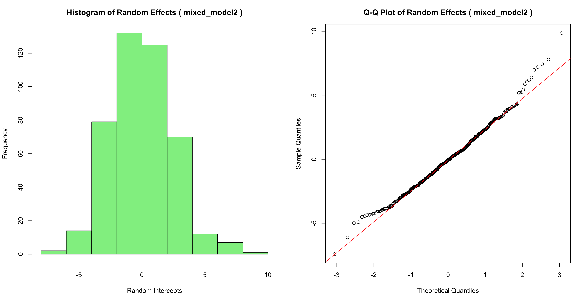

**Table S18. Mixed model 2: Kolmogorov-Smirnov test for random effects normality**

### Low intensity distance covered per minute (Zones 1 and 2)
**Table S19. Multicollinearity diagnosis**
|Predictor | VIF | VIF 95% CI | Increased SE | Tolerance | Tolerance 95% CI|
|:-----:|:-----:|:-------:|:--------------:|:-----------:|:-----------------:|
| Stage | 1.52 | [1.41, 1.65] | 1.23 | 0.66 | [0.60, 0.71] |
| Time_of_day | 4.50 | [4.06, 5.01] | 2.12 | 0.22 | [0.20, 0.25] |
| Ranking_difference | 1.16 | [1.10, 1.26] | 1.08 | 0.86 | [0.79, 0.91] |
| Player_position | 1.02 | [1.00, 1.40] | 1.01 | 0.98 | [0.71, 1.00] |
| Player_age_c | 1.04 | [1.01, 1.19] | 1.02 | 0.96 | [0.84, 0.99] |
| Origin_climate | 1.05 | [1.02, 1.18] | 1.03 | 0.95 | [0.85, 0.99] |
| Temp_c | 3.06 | [2.78, 3.39] | 1.75 | 0.33 | [0.30, 0.36] |
| UR_c | 4.14 | [3.74, 4.60] | 2.04 | 0.24 | [0.22, 0.27] |
| Time_of_day:Temp_c | 1.92 | [1.76, 2.10] | 1.38 | 0.52 | [0.48, 0.57] |
| Time_of_day:UR_c | 2.15 | [1.97, 2.37] | 1.47 | 0.46 | [0.42, 0.51] |
| RAD_c | 5.44 | [4.89, 6.06] | 2.33 | 0.18 | [0.17, 0.20] |

**Fig S17. Mixed model 2: Histogram and Q-Q Plot of residuals; scatterplot residuals x fitted. Graphical analysis of normality and homoscedasticity of residuals**


**Table S20. Mixed model 2: Kolmogorov-Smirnov test for residuals normality**

**Fig S18. Mixed model 2: Histogram and Q-Q Plot of random effects**
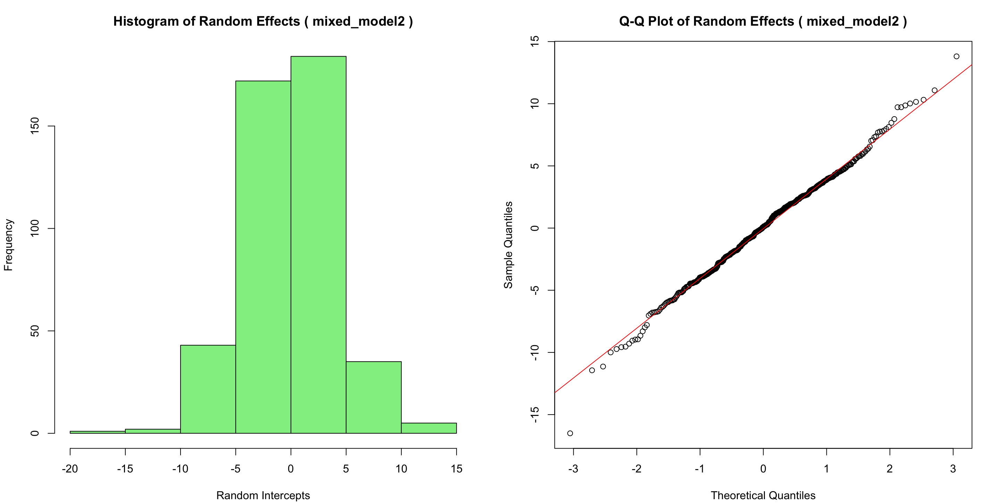

**Table S21. Mixed model 2: Kolmogorov-Smirnov test for random effects normality**

### Total distance covered per minute
**Table S22. Multicollinearity diagnosis**
|Predictor | VIF | VIF 95% CI | Increased SE | Tolerance | Tolerance 95% CI|
|:-----:|:-----:|:-------:|:--------------:|:-----------:|:-----------------:|
|Stage| 1.56 |[1.44, 1.70]|         1.25|      0.64|     [0.59, 0.69]|
|Time_of_day |4.49 |[4.05, 5.00] |        2.12|      0.22|     [0.20, 0.25]|
|Ranking_difference |1.19 |[1.12, 1.29]|         1.09|      0.84|     [0.77, 0.89]|
|Player_position | 1.02 |[1.00, 1.44] |         1.01|      0.98|     [0.69, 1.00]|
|Player_age_c | 1.04| [1.01, 1.20]|         1.02|      0.96|     [0.84, 0.99]|
|Origin_climate |1.05 |[1.01, 1.19]|         1.02|      0.95|     [0.84, 0.99]|
|Temp_c |3.17 |[2.87, 3.51] |        1.78|      0.32|     [0.29, 0.35]|
|UR_c |4.19 |[3.78, 4.66]|         2.05|      0.24|     [0.21, 0.26]|
|Time_of_day:Temp_c |1.92| [1.76, 2.10]|         1.38|      0.52|     [0.48, 0.57]|
|Time_of_day:UR_c |2.14 |[1.96, 2.35] |        1.46|      0.47|     [0.42, 0.51]|
|RAD_c |5.44 |[4.89, 6.06]|         2.33|      0.18|     [0.17, 0.20]|

**Fig S19. Mixed model 2: Histogram and Q-Q Plot of residuals; scatterplot residuals x fitted. Graphical analysis of normality and homoscedasticity of residuals**


**Table S23. Mixed model 2: Kolmogorov-Smirnov test for residuals normality**

**Fig S20. Mixed model 2: Histogram and Q-Q Plot of random effects**
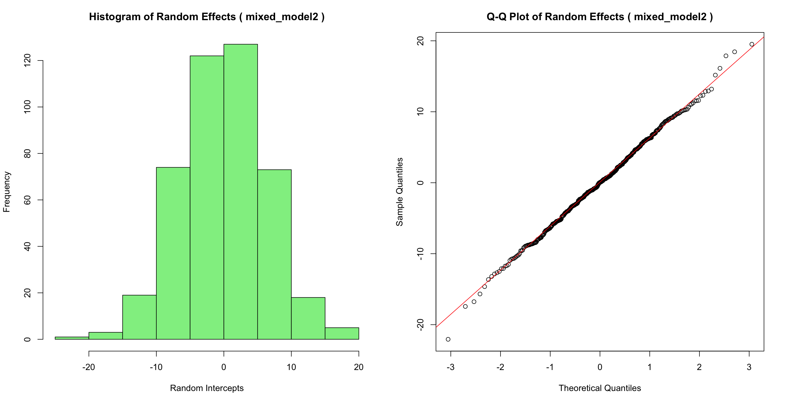

**Table S24. Mixed model 2: Kolmogorov-Smirnov test for random effects normality**

## MODEL 5 - Assumption checks
VD ~ Stage + Time_of_day + Ranking_difference + Player_position + Player_age_c + Origin_climate + WBGT_c + UR_c + (1 | Player_id) + Time_of_day * UR_c + Time_of_day * WBGT_c

### High intensity distance covered per minute (Zones 4 and 5)
**Table S25. multicollinearity diagnosis**
|Predictor | VIF | VIF 95% CI | Increased SE | Tolerance | Tolerance 95% CI|
|:-----:|:-----:|:-------:|:--------------:|:-----------:|:-----------------:|
| Stage | 1.38 | [1.29, 1.50] | 1.18 | 0.72 | [0.66, 0.77] |
| Time_of_day | 1.36 | [1.27, 1.48] | 1.17 | 0.74 | [0.68, 0.79] |
| Ranking_difference | 1.15 | [1.09, 1.25] | 1.07 | 0.87 | [0.80, 0.92] |
| Player_position | 1.02 | [1.00, 1.40] | 1.01 | 0.98 | [0.71, 1.00] |
| Player_age_c | 1.04 | [1.01, 1.19] | 1.02 | 0.96 | [0.84, 0.99] |
| Origin_climate | 1.05 | [1.01, 1.18] | 1.03 | 0.95 | [0.85, 0.99] |
| WBGT_c | 2.06 | [1.89, 2.26] | 1.43 | 0.49 | [0.44, 0.53] |
| UR_c | 2.09 | [1.92, 2.30] | 1.45 | 0.48 | [0.44, 0.52] |
| Time_of_day:UR_c | 1.72 | [1.59, 1.88] | 1.31 | 0.58 | [0.53, 0.63] |
| Time_of_day:WBGT_c | 1.70 | [1.57, 1.86] | 1.30 | 0.59 | [0.54, 0.64] |

**Fig S21. Mixed model 5: Histogram and Q-Q Plot of residuals; scatterplot residuals x fitted. Graphical analysis of normality and homoscedasticity of residuals**
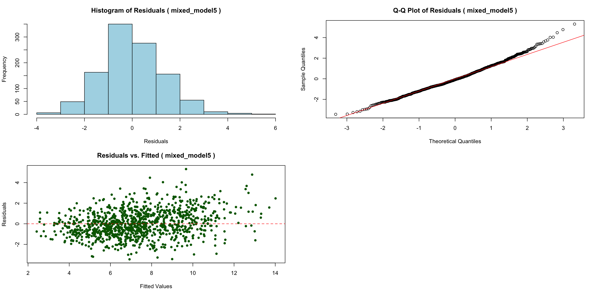

**Table S26. Mixed model 5: Kolmogorov-Smirnov test for residuals normality**

Fig S22. Mixed model 5: Histogram and Q-Q Plot of random effects 

**Table S27. Mixed model 5: Kolmogorov-Smirnov test for random effects normality**

### Moderate intensity distance covered per minute (Zone 3)
**Table S28. multicollinearity diagnosis**
|Predictor | VIF | VIF 95% CI | Increased SE | Tolerance | Tolerance 95% CI|
|:-----:|:-----:|:-------:|:--------------:|:-----------:|:-----------------:|
| Stage | 1.42 | [1.33, 1.55] | 1.19 | 0.70 | [0.65, 0.75] |
| Time_of_day | 1.36 | [1.27, 1.48] | 1.17 | 0.74 | [0.68, 0.79] |
| Ranking_difference | 1.18 | [1.12, 1.28] | 1.09 | 0.85 | [0.78, 0.89] |
| Player_position | 1.02 | [1.00, 1.45] | 1.01 | 0.98 | [0.69, 1.00] |
| Player_age_c | 1.04 | [1.01, 1.20] | 1.02 | 0.96 | [0.84, 0.99] |
| Origin_climate | 1.05 | [1.01, 1.19] | 1.02 | 0.96 | [0.84, 0.99] |
| WBGT_c | 2.10 | [1.92, 2.30] | 1.45 | 0.48 | [0.43, 0.52] |
| UR_c | 2.11 | [1.94, 2.32] | 1.45 | 0.47 | [0.43, 0.52] |
| Time_of_day:UR_c | 1.70 | [1.57, 1.86] | 1.31 | 0.59 | [0.54, 0.64] |
| Time_of_day:WBGT_c | 1.69 | [1.56, 1.84] | 1.30 | 0.59 | [0.54, 0.64] |

**Fig S23. Mixed model 5: Histogram and Q-Q Plot of residuals; scatterplot residuals x fitted. Graphical analysis of normality and homoscedasticity of residuals**
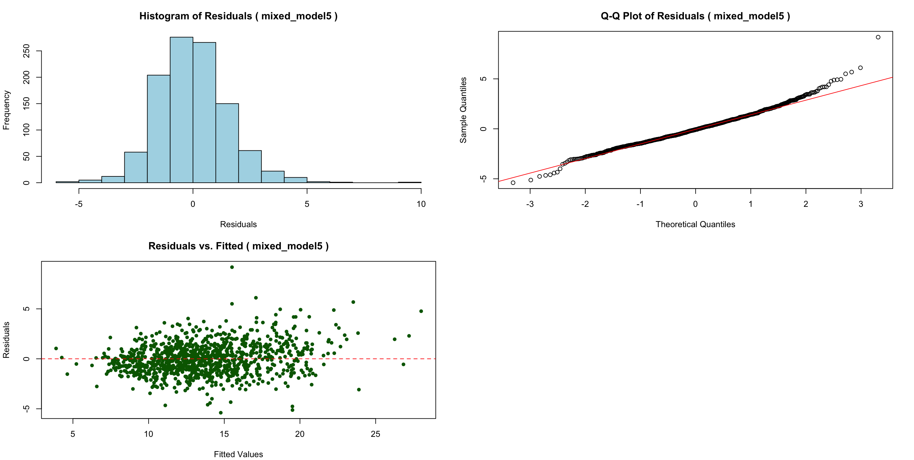

**Table S29. Mixed model 5: Kolmogorov-Smirnov test for residuals normality**

**Fig S24. Mixed model 5: Histogram and Q-Q Plot of random effects**


**Table S30. Mixed model 5: Kolmogorov-Smirnov test for random effects normality**

### Low intensity distance covered per minute (Zones 1 and 2)
**Table S31. multicollinearity diagnosis**
|Predictor | VIF | VIF 95% CI | Increased SE | Tolerance | Tolerance 95% CI|
|:-----:|:-----:|:-------:|:--------------:|:-----------:|:-----------------:|
| Stage | 1.39 | [1.30, 1.51] | 1.18 | 0.72 | [0.66, 0.77] |
| Time_of_day | 1.36 | [1.27, 1.48] | 1.17 | 0.74 | [0.68, 0.79] |
| Ranking_difference | 1.16 | [1.10, 1.26] | 1.08 | 0.86 | [0.79, 0.91] |
| Player_position | 1.02 | [1.00, 1.41] | 1.01 | 0.98 | [0.71, 1.00] |
| Player_age_c | 1.04 | [1.01, 1.19] | 1.02 | 0.96 | [0.84, 0.99] |
| Origin_climate | 1.05 | [1.01, 1.18] | 1.02 | 0.95 | [0.85, 0.99] |
| WBGT_c | 2.07 | [1.90, 2.27] | 1.44 | 0.48 | [0.44, 0.53] |
| UR_c | 2.10 | [1.92, 2.30] | 1.45 | 0.48 | [0.43, 0.52] |
| Time_of_day:UR_c | 1.72 | [1.59, 1.88] | 1.31 | 0.58 | [0.53, 0.63] |
| Time_of_day:WBGT_c | 1.70 | [1.57, 1.86] | 1.30 | 0.59 | [0.54, 0.64] |

**Fig S25. Mixed model 5: Histogram and Q-Q Plot of residuals; scatterplot residuals x fitted. Graphical analysis of normality and homoscedasticity of residuals**
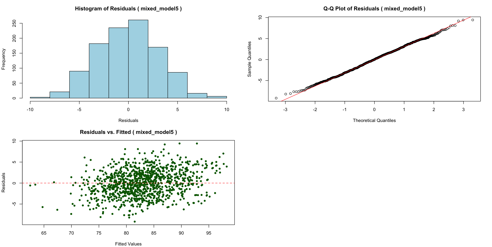

**Table S32. Mixed model 5: Kolmogorov-Smirnov test for residuals normality**

**Fig S26. Mixed model 5: Histogram and Q-Q Plot of random effects**
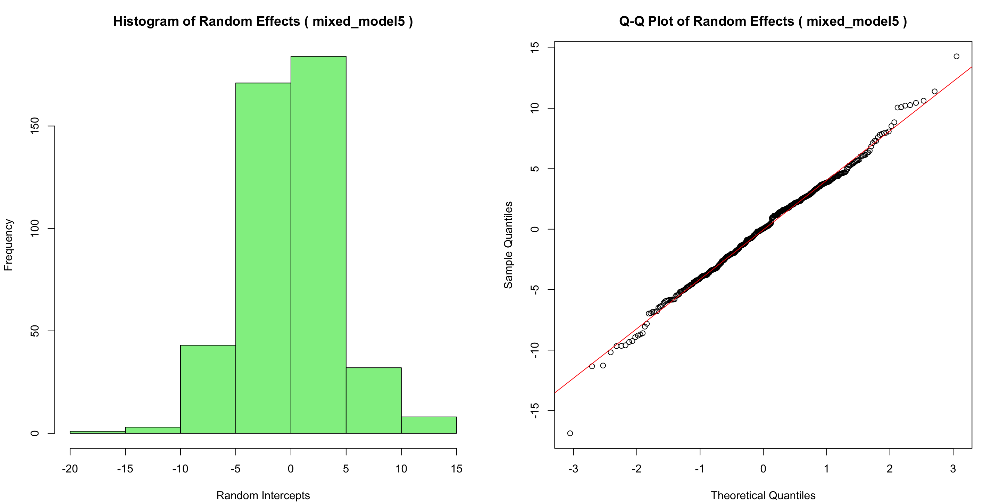

**Table S33. Mixed model 5: Kolmogorov-Smirnov test for random effects normality**

### Total distance covered per minute
**Table S34. multicollinearity diagnosis**
|Predictor | VIF | VIF 95% CI | Increased SE | Tolerance | Tolerance 95% CI|
|:-----:|:-----:|:-------:|:--------------:|:-----------:|:-----------------:|
|Stage| 1.43| [1.33, 1.55]|         1.19|      0.70|     [0.64, 0.75]|
|Time_of_day |1.36 |[1.27, 1.48]|         1.17|      0.74|     [0.68, 0.79]|
|Ranking_difference |1.19| [1.12, 1.29]|         1.09|      0.84|     [0.78, 0.89]|
|Player_position |1.02 |[1.00, 1.45]|         1.01|      0.98|     [0.69, 1.00]|
|Player_age_c |1.04 |[1.01, 1.20]|         1.02|      0.96|     [0.83, 0.99]|
|Origin_climate |1.05 |[1.01, 1.19]|         1.02|      0.96|     [0.84, 0.99]|
|WBGT_c |2.10 |[1.93, 2.31]|         1.45|      0.48|     [0.43, 0.52]|
|UR_c| 2.12| [1.94, 2.32]|         1.45|      0.47|     [0.43, 0.52]|
|Time_of_day:UR_c |1.70| [1.57, 1.86]|         1.30|      0.59|     [0.54, 0.64]|
|Time_of_day:WBGT_c |1.69 |[1.56, 1.84]|         1.30|      0.59|     [0.54, 0.64]|

**Fig S27. Mixed model 5: Histogram and Q-Q Plot of residuals; scatterplot residuals x fitted. Graphical analysis of normality and homoscedasticity of residuals**


**Table S35. Mixed model 5: Kolmogorov-Smirnov test for residuals normality**

**Fig S28. Mixed model 5: Histogram and Q-Q Plot of random effects**


**Table S36. Mixed model 5: Kolmogorov-Smirnov test for random effects normality**


## Licença

Este projeto está sob a licença MIT. Veja o arquivo LICENSE para mais detalhes.

---

Dúvidas ou sugestões? Abra uma issue ou envie um pull request!

LAFISE - Laboratório de Fisiologia do exercício - UFMG
